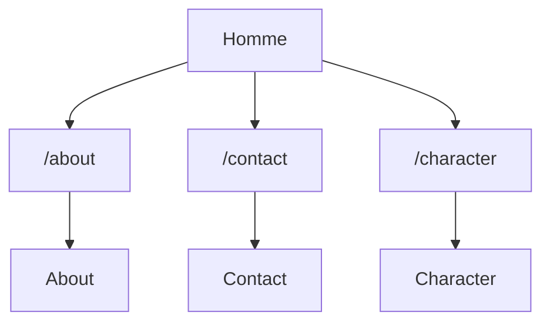

# Marvel App

## Installation

### Récupérer le projet en local et in installer les dépendances

```
git clone url-du-projet
cd marvel-app
npm install
```


## Lancement
```
npm start
```
L'application est accessible à l'adresse http://localhost:3000


## Test
### Execution des tests unitaires en mode watch, c'est à dire que les tests sont relancés à chaque modification de code.
```
npm test
```
### Execution des tests uniquement une fois avec un rapport détaillé de la couverture de code
```
npm run test:coverage
```

## Conception

Le projet est composé de 4 pages :
- Homme (page d'accueil): Liste des personnages
- Character: Page de détail d'un personnage
- About: Page de détail d'un personnage
- Contact: Page de contact

